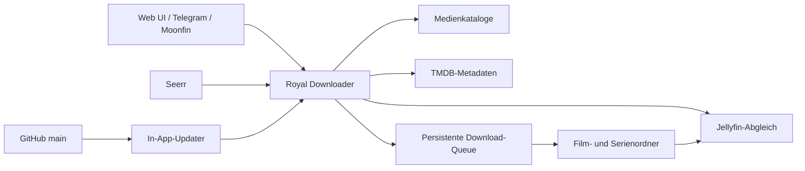

<p align="center">
  
</p>

<p align="center">
  <strong>Self-hosted Medienautomatisierung für Jellyfin, Telegram und Seerr.</strong><br>
  Entwickelt für den dauerhaften Betrieb auf Docker- und NAS-Systemen.
</p>

<p align="center">
  
  
  
  
  
</p>

Royal Downloader bündelt Suche, Download-Queue, Bibliotheksabgleich und
Automatisierung in einer Weboberfläche. Filme und Serien können über mehrere
konfigurierbare Quellen gefunden, gegen Jellyfin geprüft und anschließend in
die gemounteten Medienordner geschrieben werden.

> [!IMPORTANT]
> Dieses Projekt ist für den privaten, selbst gehosteten Betrieb gedacht. Nutze
> ausschließlich Inhalte und Quellen, für deren Zugriff und Speicherung du die
> erforderlichen Rechte besitzt. Du bist selbst für die Einhaltung geltender
> Gesetze, Urheberrechte und Nutzungsbedingungen verantwortlich.

## Kernfunktionen

- **Film- und Seriensuche** mit konfigurierbarer Anbieterpriorität und Fallbacks.
- **Intelligente Filmseiten**: providerübergreifend gemischt, dedupliziert und
  mit sichtbarer Quellenverteilung.
- **Jellyfin-Duplikatschutz** für Filme, Serien und einzelne Episoden.
- **Serien-Abos** mit Regeln für neue oder noch ungesehene Staffeln.
- **Telegram-Bot** für Film-, Serien- und Statusanfragen.
- **Seerr-/Moonfin-Brücke** für Medienwünsche ohne Radarr oder Sonarr.
- **TMDB-Metadaten** für Cover, Beschreibungen, Laufzeiten und Genres.
- **Jellyfin-Empfehlungen** als automatisch gepflegte Collection.
- **Persistente Queue** mit Hoster-Fallbacks, Wiederaufnahme und Integritätsprüfung.
- **In-App-Updater** gegen einen konfigurierbaren GitHub-Branch.

## Schnellstart mit Docker Compose

Voraussetzungen: Docker Engine, Docker Compose v2 und Schreibzugriff auf die
Jellyfin-Medienordner.

```bash
git clone https://github.com/TimeLance89/RoyalDownloader.git
cd RoyalDownloader
cp .env.example .env
```

Danach mindestens `MOVIES_HOST_DIR` und `SERIES_HOST_DIR` in `.env` an die
NAS-Pfade anpassen und starten:

```bash
docker compose up -d --build
docker compose logs -f seriendownloader
```

Die Weboberfläche ist anschließend unter `http://<NAS-IP>:8765` erreichbar.
Beim ersten Aufruf führt ein Wizard durch Speicherorte, Jellyfin, TMDB,
Automatik und Telegram.

> [!TIP]
> Setze für den Zugriff im Heimnetz mindestens `APP_USERNAME` und
> `APP_PASSWORD`. Veröffentliche Port `8765` nicht ungeschützt im Internet.

Die vollständige NAS-, Volume-, Seerr-, DNS- und Update-Konfiguration steht in
der **[Docker-/NAS-Anleitung](DOCKER.md)**.

## Architektur



## Daten und Updates

| Pfad | Inhalt | Backup |
|---|---|---|
| `./data` | Einstellungen, Watchlist, Queue, Cookies und Seerr-Daten | erforderlich |
| `./runtime` | aktiver Programmstand für In-App-Updates | empfohlen |
| Film-/Serienmounts | fertige Mediendateien | nach eigener Strategie |

Der Updater ersetzt ausschließlich Programmdateien. `data`, `.env`, Medien und
persistente Einstellungen bleiben erhalten. Vor einem Update sollten laufende
Downloads beendet sein.

## Dokumentation

| Thema | Dokument |
|---|---|
| Installation auf Docker/NAS, Volumes und Umgebungsvariablen | [DOCKER.md](DOCKER.md) |
| Jellyfin-Empfehlungscollection | [JELLYFIN_RECOMMENDER.md](JELLYFIN_RECOMMENDER.md) |
| Migration bestehender Installationen auf `RoyalDownloader` | [docs/REPOSITORY_RENAME.md](docs/REPOSITORY_RENAME.md) |
| Fehler melden und Änderungen beitragen | [CONTRIBUTING.md](CONTRIBUTING.md) |
| Sicherheitslücken vertraulich melden | [SECURITY.md](SECURITY.md) |

## Projektstruktur

```text
RoyalDownloader/
├─ server.py                  FastAPI, WebSocket und Automatisierung
├─ *_scraper.py               Katalog- und Serienintegrationen
├─ downloader.py              Queue, Transfer und Integritätsprüfung
├─ jellyfin_client.py         Bibliotheks- und Duplikatabgleich
├─ self_updater.py            verifizierter GitHub-Updater
├─ web/                       Weboberfläche
├─ docker-compose.yml         NAS-/Compose-Betrieb
├─ Dockerfile                 reproduzierbares Laufzeit-Image
└─ DOCKER.md                  vollständiges Betriebshandbuch
```

## Support und Beiträge

- Fehler bitte über das passende **Bug-Formular** unter GitHub Issues melden.
- Zugangsdaten, API-Keys, Cookies und vollständige `settings.ini` niemals posten.
- Feature-Ideen sollten den Anwendungsfall und das gewünschte Verhalten nennen.
- Änderungen folgen dem Ablauf in [CONTRIBUTING.md](CONTRIBUTING.md).

## Repository

Das Projekt liegt unter
**[TimeLance89/RoyalDownloader](https://github.com/TimeLance89/RoyalDownloader)**.
Bestehende Installationen und lokale Klone können mit der
**[Migrationsanleitung](docs/REPOSITORY_RENAME.md)** auf die neue Adresse
umgestellt werden.
