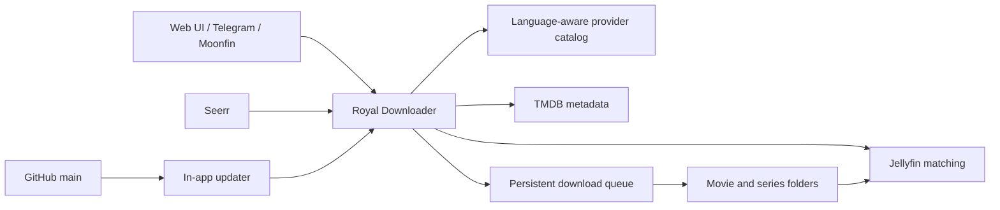

<p align="center">
  
</p>

<p align="center">
  <strong>Self-hosted media automation for Jellyfin, Telegram, and Seerr.</strong><br>
  Built for reliable 24/7 operation on Docker and NAS systems.
</p>

<p align="center">
  
  
  
  
  
  
</p>

Royal Downloader combines discovery, provider routing, a persistent download
queue, library checks, and media automation in one web application. Movies,
series, and anime are discovered through configurable language-aware providers,
checked against Jellyfin, and written directly to mounted media folders.

> [!IMPORTANT]
> Royal Downloader is intended for private, self-hosted use. Only access and
> store content for which you have the required rights. You are responsible for
> complying with applicable laws, copyright rules, and provider terms.

## Why Royal Downloader?

Most self-hosted media workflows depend on several disconnected tools. Royal
Downloader keeps the full route visible and controllable:

```text
discover → match → de-duplicate → select provider → download → verify → scan Jellyfin
```

Its provider fallback logic is designed for sources that may disappear, throttle
downloads, present anti-bot gates, or expose different language tracks. Queue
state survives restarts, individual failures do not discard the remaining work,
and Jellyfin remains the source of truth for content already in the library.

## Highlights

- **Movies, series, and anime** in a responsive desktop and mobile interface.
- **Language-aware provider catalog** with separate German and English content
  profiles, provider priorities, and explicit download-language metadata.
- **Cross-provider discovery** with deterministic mixing, de-duplication,
  source distribution, and configurable fallback order.
- **Persistent queue** with resume support, integrity checks, hoster fallbacks,
  slow-source detection, and safe restart behavior.
- **Jellyfin de-duplication** for movies, series, seasons, and individual episodes.
- **Series subscriptions** for all missing content, the latest season, or the
  next season based on a Jellyfin user's watched state.
- **Telegram bot** for movie and series requests, queue status, storage status,
  and completion notifications.
- **Seerr and Moonfin bridge** for media requests without requiring Radarr or Sonarr.
- **TMDB metadata** for artwork, descriptions, genres, ratings, and runtime.
- **Jellyfin recommendations** maintained as an automatically updated collection.
- **Multilingual web UI** with language selection during onboarding and in settings.
- **In-app updater** plus queue-safe automatic updates for Royal Downloader and yt-dlp.

## Provider catalog

Providers are selectable and reorderable during onboarding and later in
settings. Their language is part of the central catalog and follows every
download job.

| Provider | Content language | Movies | Series | Anime |
|---|---:|:---:|:---:|:---:|
| FilmFrei24 | German | ✓ |  |  |
| Filmpalast | German | ✓ | ✓ |  |
| MegaKino | German | ✓ | ✓ |  |
| Moflix | German | ✓ | ✓ |  |
| Einschalten | German | ✓ |  |  |
| Kinox | German | ✓ |  |  |
| KinoGer | German | ✓ | ✓ |  |
| XCine | German | ✓ | ✓ |  |
| SerienStream | German |  | ✓ |  |
| SFlix | English | ✓ | ✓ |  |
| Ridomovies | English | ✓ | ✓ |  |
| MKissa | English |  |  | ✓ |

> [!NOTE]
> Third-party providers can change or become unavailable without notice.
> Provider adapters are therefore isolated, ordered, and designed to fail over.

## Quick start with Docker Compose

Requirements:

- Docker Engine
- Docker Compose v2
- Write access to the Jellyfin movie and series directories

```bash
git clone https://github.com/TimeLance89/RoyalDownloader.git
cd RoyalDownloader
cp .env.example .env
```

Set at least `MOVIES_HOST_DIR` and `SERIES_HOST_DIR` in `.env`. For access
from other devices additionally set `BIND_ADDRESS=0.0.0.0` together with
`APP_USERNAME` and `APP_PASSWORD` – the ports are host-local by default, and
with network exposure and no credentials the container refuses to start.
Then start:

```bash
docker compose up -d --build
docker compose logs -f seriendownloader
```

Open `http://<NAS-IP>:8765`. The first-run wizard configures the interface
language, content languages, providers, storage paths, Jellyfin, TMDB,
automation, and Telegram.

> [!TIP]
> Never expose port `8765` directly to the public internet.

See the complete [Docker and NAS guide](docs/DOCKER.md) for volume, Seerr, DNS,
update, and migration details.

## Architecture



## Persistent data and updates

| Path | Purpose | Backup |
|---|---|---|
| `./data` | Settings, subscriptions, queue, cookies, and Seerr state | Required |
| `./runtime` | Active application revision used by in-app updates | Recommended |
| Movie and series mounts | Completed media files | Use your own backup policy |

The updater replaces application files only. It preserves `data`, `.env`,
media folders, and persistent settings. Automatic application updates wait
until no download or download preparation is active.

## Documentation

| Topic | Document |
|---|---|
| Docker and NAS installation, volumes, environment variables, and integrations | [docs/DOCKER.md](docs/DOCKER.md) |
| Jellyfin recommendation collection | [docs/JELLYFIN_RECOMMENDER.md](docs/JELLYFIN_RECOMMENDER.md) |
| Migration from the previous repository name | [docs/REPOSITORY_RENAME.md](docs/REPOSITORY_RENAME.md) |
| Development and pull requests | [CONTRIBUTING.md](CONTRIBUTING.md) |
| Private vulnerability reporting | [SECURITY.md](SECURITY.md) |

## Project structure

```text
RoyalDownloader/
├─ providers/                 isolated movie, series, and anime adapters
├─ web/                       framework-free web application
├─ docs/                      installation and operations documentation
├─ server.py                  FastAPI, WebSocket, and automation layer
├─ downloader.py              queue, transfer, and integrity verification
├─ jellyfin_client.py         library matching and de-duplication
├─ self_updater.py            verified GitHub update workflow
├─ docker-compose.yml         NAS and Docker Compose deployment
├─ Dockerfile                 reproducible runtime image
└─ start.sh                   mounted-folder NAS bootstrap
```

## Roadmap

- Additional content languages and provider adapters
- Broader anime coverage
- More provider health and routing intelligence
- Better diagnostics for unattended installations

## Contributing

Bug reports and focused pull requests are welcome. Start with
[CONTRIBUTING.md](CONTRIBUTING.md), use the matching GitHub issue form, and
remove credentials, cookies, private addresses, and media paths from all logs.

Royal Downloader is actively developed at
[TimeLance89/RoyalDownloader](https://github.com/TimeLance89/RoyalDownloader).
