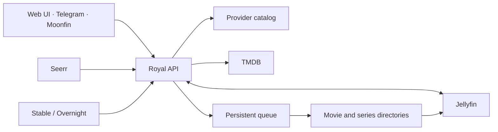

<p align="center">
  
</p>

<p align="center">
  <strong>Your private media hub for movies, series, and anime.</strong><br>
  Run it locally on a computer or continuously on a NAS.
</p>

<p align="center">
  
  
  
  
  
  
</p>

Royal Downloader combines discovery, library matching, provider routing, a
persistent download queue, and media automation in one interface. Content that
already exists in Jellyfin is detected and is not offered for download again.

> [!IMPORTANT]
> Royal Downloader is intended for private, self-hosted use. Only access and
> store content for which you have the required rights. You are responsible for
> complying with applicable laws and provider terms.

> [!WARNING]
> **`v1.0.0-rc.3` is a release candidate.** Back up at least `.env` and `data/`
> before updating. Upgrade and rollback instructions are available in the
> [release guide](docs/RELEASE.md).

## What Royal handles

```text
Discover → Check Jellyfin → Select provider → Download → Verify → Update library
```

| Area | Features |
|---|---|
| **Discovery** | Movies, series, anime, language-aware catalogs, TMDB metadata, daily Top 10, and personal recommendations |
| **Downloads** | Persistent queue, resume support, integrity checks, provider fallbacks, and safe restarts |
| **Jellyfin** | Detection of existing movies, seasons, and episodes, playback status, and recommendation collections |
| **Automation** | Series subscriptions, Telegram requests, Seerr/Moonfin, and scheduled downloads |
| **Administration** | User accounts, persistent sessions, device sign-out, updates, and Stable/Overnight channels |
| **Personalization** | A private taste profile based on selections, feedback, downloads, and Jellyfin playback |

## One project, two operating modes

The first-run wizard asks where Royal should run. The selection can later be
changed under **Settings → General → Operating mode**.

| | Computer | NAS / home server |
|---|---|---|
| **Use case** | Regular Windows, macOS, or Linux application | Continuous service on the home network |
| **Network** | Accessible only on the current computer | Accessible throughout the local network |
| **Browser** | Opens automatically at startup | Open `http://<NAS-IP>:8765` from another device |
| **Start command** | `start_windows.cmd` or `python server.py` | `start.sh` or Docker Compose |
| **Default storage** | Local folders | Mounted media directories |

When only `.env.example` exists, the first-run wizard automatically creates a
matching `.env` when setup is completed. Custom variables are preserved when
the operating mode is changed later.

## Quick start: Windows

Requirements:

- Python 3.12 or newer
- Google Chrome or Chromium

Download or clone the repository, then double-click
[`start_windows.cmd`](start_windows.cmd). The launcher checks the Python
dependencies and opens Royal locally in the browser.

Alternatively, use PowerShell:

```powershell
py -3 -m pip install -r requirements.lock
py -3 server.py
```

Select **Regular computer** in the wizard and choose separate movie and series
directories.

## Quick start: macOS or Linux

```bash
git clone --branch v1.0.0-rc.3 --depth 1 https://github.com/TimeLance89/RoyalDownloader.git
cd RoyalDownloader
python3 -m pip install -r requirements.lock
python3 server.py
```

Select **Regular computer**. Royal binds to the local machine and opens the
interface in the default browser.

## Quick start: NAS with `start.sh`

This mode is intended for NAS systems that mount the project directory into a
Python container.

```bash
git clone --branch v1.0.0-rc.3 --depth 1 https://github.com/TimeLance89/RoyalDownloader.git
cd RoyalDownloader
bash start.sh
```

`start.sh` prepares Chromium, ffmpeg, the Python dependencies, and the
versioned runtime. Select **NAS / home server** during first-run setup. If
`.env` is missing, it is created from `.env.example`.

## Quick start: Docker Compose

Requirements:

- Docker Engine
- Docker Compose v2
- Write access to the movie and series directories

```bash
git clone --branch v1.0.0-rc.3 --depth 1 https://github.com/TimeLance89/RoyalDownloader.git
cd RoyalDownloader
cp .env.example .env
```

Set at least these host paths in `.env` before starting:

```dotenv
MOVIES_HOST_DIR=/path/to/Movies
SERIES_HOST_DIR=/path/to/Series
```

Start and verify the service:

```bash
docker compose up -d --build
docker compose logs -f seriendownloader
curl --fail http://127.0.0.1:8765/api/health
```

Royal is now available at `http://<NAS-IP>:8765`. Docker Compose requires
`.env` before the first build because Docker reads the host media paths from
that file.

> [!TIP]
> Never expose port `8765` directly to the public internet. Use a secured
> reverse proxy or tunnel for remote access and follow the
> [Docker and NAS guide](docs/DOCKER.md).

## First-run setup

The wizard guides you through the complete configuration in six steps:

1. **Operating mode and language** – computer or NAS and interface language
2. **Sources** – content languages, providers, and fallback order
3. **Storage** – separate movie and series directories
4. **Library** – optional Jellyfin connection and required TMDB access
5. **Automation** – subscriptions, download windows, and Telegram
6. **Access** – local administrator account

The setup starts in English. Selecting another language immediately translates
the visible wizard. A valid TMDB API key or read access token is required to
complete setup and is verified before the configuration is saved.

Credentials, API keys, cookies, and private paths must never be committed to
Git or included in public bug reports.

## Integrations

- **Jellyfin** detects existing media and supplies playback status and library
  information.
- **TMDB** is required during setup and supplies stable IDs, artwork,
  descriptions, genres, runtime, and ratings.
- **Telegram** accepts media requests and reports queue, storage, and completion
  status.
- **Seerr / Moonfin** sends media requests directly to Royal without requiring
  Radarr or Sonarr.
- **GitHub Updater** installs verified revisions and retains the previous
  version for rollback.

<details>
<summary><strong>Show supported providers</strong></summary>

| Provider | Language | Movies | Series | Anime |
|---|:---:|:---:|:---:|:---:|
| Filmpalast | DE | ✓ | ✓ | |
| Huhu | DE | ✓ | ✓ | |
| MegaKino | DE | ✓ | ✓ | |
| Moflix | DE | ✓ | ✓ | |
| FilmFrei24 | DE | ✓ | | |
| Einschalten | DE | ✓ | | |
| Kinox | DE | ✓ | | |
| KinoGer | DE | ✓ | ✓ | |
| XCine | DE | ✓ | ✓ | |
| SerienStream | DE | | ✓ | |
| SFlix | EN | ✓ | ✓ | |
| Ridomovies | EN | ✓ | ✓ | |
| MKissa | EN | | | ✓ |

Third-party providers can change or become unavailable at any time. Royal keeps
the adapters isolated and moves through the configured fallback order when a
provider fails.

</details>

## Data and updates

| Path | Contents | Backup |
|---|---|---|
| `.env` | Operating mode, mounts, update token, and optional environment variables | Required |
| `data/` | Settings, account, queue, subscriptions, cookies, and taste profile | Required |
| `runtime/` | Active and previous versioned application releases | Recommended |
| Media directories | Completed movies and series | Use your own backup strategy |

The updater builds new revisions in isolation, runs verification checks, and
only then switches atomically to the new version. `runtime/previous` remains
available for rollback. Select **Stable** or **Overnight** under
**Settings → Updates and maintenance**.

If GitHub's anonymous API limit is reached, create a fine-grained read-only
token and store it in `.env`:

```dotenv
UPDATE_GITHUB_TOKEN=github_pat_your_token
```

For Stable, repository contents read access is sufficient. Overnight also
needs read access to checks. Restart Royal after changing `.env`.

## Architecture


```mermaid
flowchart LR
    CLIENTS["Web UI · Telegram · Moonfin"] --> API["Royal API"]
    API --> CATALOG["Provider catalog"]
    API --> TMDB["TMDB"]
    API <--> JELLYFIN["Jellyfin"]
    API --> QUEUE["Persistent queue"]
    QUEUE --> MEDIA["Movie and series directories"]
    MEDIA --> JELLYFIN
    SEERR["Seerr"] --> API
    UPDATE["Stable / Overnight"] --> API
```

<details>
<summary><strong>Show project structure</strong></summary>

```text
RoyalDownloader/
├─ application_services/    catalogs, downloads, and integrations
├─ providers/               isolated movie, series, and anime adapters
├─ web/                     responsive framework-free web application
├─ docs/                    operations, API, and architecture documentation
├─ api_*_router.py          FastAPI and WebSocket endpoints
├─ server.py                application lifecycle and web hosting
├─ downloader.py            queue, transfer, and integrity verification
├─ jellyfin_client.py       library matching and de-duplication
├─ environment_file.py      safe .env generation and mode management
├─ start_windows.cmd        Windows launcher
├─ start.sh                 NAS and container bootstrap
├─ docker-compose.yml       Docker deployment
└─ .env.example             documented configuration template
```

</details>

## Documentation

| Topic | Document |
|---|---|
| Changes and new features | [CHANGELOG.md](CHANGELOG.md) |
| Docker, NAS, volumes, and remote access | [docs/DOCKER.md](docs/DOCKER.md) |
| Installation, upgrades, backups, and rollback | [docs/RELEASE.md](docs/RELEASE.md) |
| Stable and Overnight channels | [docs/UPDATE_CHANNELS.md](docs/UPDATE_CHANNELS.md) |
| Queue jobs and history | [docs/QUEUE_JOBS.md](docs/QUEUE_JOBS.md) |
| Jellyfin recommendations | [docs/JELLYFIN_RECOMMENDER.md](docs/JELLYFIN_RECOMMENDER.md) |
| Personalization and privacy | [docs/PERSONALIZATION.md](docs/PERSONALIZATION.md) |
| Android API and WebSocket contract | [docs/ANDROID_API.md](docs/ANDROID_API.md) |
| Architecture and ownership boundaries | [docs/ARCHITECTURE.md](docs/ARCHITECTURE.md) |
| Development and pull requests | [CONTRIBUTING.md](CONTRIBUTING.md) |
| Private vulnerability reporting | [SECURITY.md](SECURITY.md) |

## Contributing

Bug reports and focused pull requests are welcome. Read
[CONTRIBUTING.md](CONTRIBUTING.md) first and remove all private data from logs
and screenshots.

Development: [TimeLance89/RoyalDownloader](https://github.com/TimeLance89/RoyalDownloader)
