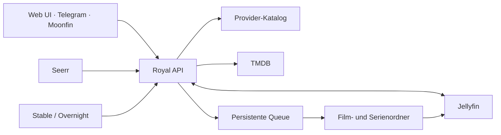

<p align="center">
  
</p>

<p align="center">
  <strong>Deine private Medienzentrale für Filme, Serien und Anime.</strong><br>
  Lokal auf dem Computer oder rund um die Uhr auf dem NAS.
</p>

<p align="center">
  
  
  
  
  
  
</p>

Royal Downloader verbindet Entdeckung, Bibliotheksprüfung, Provider-Auswahl,
Download-Queue und Medienautomatisierung in einer Oberfläche. Bereits in
Jellyfin vorhandene Inhalte werden erkannt und nicht erneut angeboten.

> [!IMPORTANT]
> Royal Downloader ist für den privaten, selbst gehosteten Einsatz gedacht.
> Verwende und speichere nur Inhalte, für die du die erforderlichen Rechte
> besitzt. Für die Einhaltung von Gesetzen und Anbieterbedingungen bist du
> selbst verantwortlich.

> [!WARNING]
> **`v1.0.0-rc.2` ist ein Release Candidate.** Sichere vor Updates mindestens
> `.env` und `data/`. Hinweise zu Upgrade und Rollback stehen im
> [Release-Handbuch](docs/RELEASE.md).

## Was Royal übernimmt

```text
Entdecken → Jellyfin prüfen → Provider wählen → Laden → Prüfen → Bibliothek aktualisieren
```

| Bereich | Funktionen |
|---|---|
| **Entdecken** | Filme, Serien und Anime, sprachabhängige Kataloge, TMDB-Metadaten und persönliche Empfehlungen |
| **Herunterladen** | Persistente Queue, Wiederaufnahme, Integritätsprüfung, Provider-Fallbacks und sichere Neustarts |
| **Jellyfin** | Erkennung vorhandener Filme, Staffeln und Episoden, Wiedergabestatus und Empfehlungs-Collection |
| **Automatisieren** | Serien-Abos, Telegram-Anfragen, Seerr/Moonfin und zeitgesteuerte Downloads |
| **Verwalten** | Benutzerkonto, dauerhafte Sitzungen, Geräteabmeldung, Updates und Stable-/Overnight-Kanäle |
| **Personalisieren** | Privates Geschmacksprofil aus Auswahl, Feedback, Downloads und Jellyfin-Wiedergabe |

## Ein Projekt, zwei Betriebsarten

Der Einrichtungsassistent fragt beim ersten Start, wo Royal laufen soll. Die
Auswahl kann später unter **Einstellungen → Allgemein → Betriebsmodus** geändert
werden.

| | Computer | NAS / Heimserver |
|---|---|---|
| **Einsatz** | Normale Anwendung auf Windows, macOS oder Linux | Dauerbetrieb im Heimnetz |
| **Netzwerk** | Nur auf diesem Computer erreichbar | Im lokalen Netzwerk erreichbar |
| **Browser** | Öffnet sich beim Start automatisch | Zugriff über `http://<NAS-IP>:8765` |
| **Start** | `start_windows.cmd` oder `python server.py` | `start.sh` oder Docker Compose |
| **Standardpfade** | Lokale Ordner | Eingebundene Medienordner |

Wenn nur `.env.example` vorhanden ist, erzeugt der Einrichtungsassistent beim
Abschluss automatisch eine passende `.env`. Vorhandene eigene Variablen bleiben
bei späteren Moduswechseln erhalten.

## Schnellstart: Windows

Voraussetzungen:

- Python 3.12 oder neuer
- Google Chrome oder Chromium

Repository herunterladen oder klonen und anschließend
[`start_windows.cmd`](start_windows.cmd) doppelt anklicken. Der Starter prüft
die Python-Abhängigkeiten und öffnet Royal lokal im Browser.

Alternativ in PowerShell:

```powershell
py -3 -m pip install -r requirements.lock
py -3 server.py
```

Im Assistenten **Normaler Computer** auswählen und die gewünschten Film- und
Serienordner festlegen.

## Schnellstart: macOS oder Linux

```bash
git clone --branch v1.0.0-rc.2 --depth 1 https://github.com/TimeLance89/RoyalDownloader.git
cd RoyalDownloader
python3 -m pip install -r requirements.lock
python3 server.py
```

Danach **Normaler Computer** auswählen. Royal bindet sich nur lokal und öffnet
die Oberfläche im Standardbrowser.

## Schnellstart: NAS mit `start.sh`

Diese Variante ist für NAS-Systeme gedacht, die den Projektordner in einen
Python-Container einbinden.

```bash
git clone --branch v1.0.0-rc.2 --depth 1 https://github.com/TimeLance89/RoyalDownloader.git
cd RoyalDownloader
bash start.sh
```

`start.sh` richtet Chromium, ffmpeg, Python-Abhängigkeiten und den versionierten
Runtime ein. Beim ersten Setup **NAS / Heimserver** auswählen. Fehlt `.env`,
wird sie aus `.env.example` erstellt.

## Schnellstart: Docker Compose

Voraussetzungen:

- Docker Engine
- Docker Compose v2
- Schreibzugriff auf die Film- und Serienordner

```bash
git clone --branch v1.0.0-rc.2 --depth 1 https://github.com/TimeLance89/RoyalDownloader.git
cd RoyalDownloader
cp .env.example .env
```

Vor dem Start mindestens diese Hostpfade in `.env` anpassen:

```dotenv
MOVIES_HOST_DIR=/pfad/zu/Filme
SERIES_HOST_DIR=/pfad/zu/Serien
```

Dann starten und prüfen:

```bash
docker compose up -d --build
docker compose logs -f seriendownloader
curl --fail http://127.0.0.1:8765/api/health
```

Royal ist anschließend unter `http://<NAS-IP>:8765` erreichbar. Die
Docker-Variante benötigt `.env` bereits vor dem ersten Build, weil Docker die
Hostpfade aus dieser Datei liest.

> [!TIP]
> Port `8765` niemals ungeschützt ins öffentliche Internet weiterleiten. Für
> Fernzugriff einen abgesicherten Reverse Proxy oder Tunnel verwenden und die
> Hinweise im [Docker- und NAS-Handbuch](docs/DOCKER.md) beachten.

## Ersteinrichtung

Der Assistent führt in sechs Schritten durch die vollständige Konfiguration:

1. **Betriebsart und Sprache** – Computer oder NAS sowie Oberflächensprache
2. **Quellen** – Inhaltssprachen, Provider und Fallback-Reihenfolge
3. **Speicherorte** – getrennte Ordner für Filme und Serien
4. **Bibliothek** – optionales Jellyfin und verpflichtender TMDB-Zugang
5. **Automatik** – Abos, Zeitfenster und Telegram
6. **Zugang** – lokales Administratorkonto

Zugangsdaten, API-Schlüssel, Cookies und private Pfade gehören weder in Git
noch in öffentliche Fehlerberichte.

## Integrationen

- **Jellyfin** erkennt vorhandene Medien und liefert Wiedergabestatus sowie
  Bibliotheksinformationen.
- **TMDB** ist bei der Einrichtung erforderlich und ergänzt eindeutige IDs,
  Cover, Hintergründe, Beschreibungen, Genres, Laufzeit und Bewertungen.
- **Telegram** nimmt Medienanfragen an und meldet Queue-, Speicher- und
  Abschlussstatus.
- **Seerr / Moonfin** übergibt Medienwünsche direkt an Royal, ohne Radarr oder
  Sonarr vorauszusetzen.
- **GitHub Updater** installiert geprüfte Revisionen und hält eine vorherige
  Version für Rollbacks bereit.

<details>
<summary><strong>Unterstützte Provider anzeigen</strong></summary>

| Provider | Sprache | Filme | Serien | Anime |
|---|:---:|:---:|:---:|:---:|
| Filmpalast | DE | ✓ | ✓ | |
| Huhu | DE | ✓ | ✓ | |
| MegaKino | DE | ✓ | ✓ | |
| Moflix | DE | ✓ | ✓ | |
| FilmFrei24 | DE | ✓ | | |
| Einschalten | DE | ✓ | | |
| Kinox | DE | ✓ | | |
| KinoGer | DE | ✓ | ✓ | |
| XCine | DE | ✓ | ✓ | |
| SerienStream | DE | | ✓ | |
| SFlix | EN | ✓ | ✓ | |
| Ridomovies | EN | ✓ | ✓ | |
| MKissa | EN | | | ✓ |

Provider können sich jederzeit ändern oder ausfallen. Royal kapselt die
Adapter deshalb einzeln und wechselt anhand der konfigurierten Reihenfolge auf
verfügbare Alternativen.

</details>

## Daten und Updates

| Pfad | Inhalt | Sicherung |
|---|---|---|
| `.env` | Betriebsmodus, Mounts und optionale Umgebungsvariablen | Erforderlich |
| `data/` | Einstellungen, Konto, Queue, Abos, Cookies und Geschmacksprofil | Erforderlich |
| `runtime/` | Aktive und vorherige versionierte Anwendung | Empfohlen |
| Medienordner | Fertige Filme und Serien | Eigene Backup-Strategie |

Der Updater baut neue Revisionen isoliert, führt Prüfungen aus und wechselt erst
danach atomar auf die neue Version. `runtime/previous` bleibt als Rollback
erhalten. Die Kanäle **Stable** und **Overnight** lassen sich unter
**Einstellungen → Updates und Wartung** wählen.

## Architektur


```mermaid
flowchart LR
    CLIENTS["Web UI · Telegram · Moonfin"] --> API["Royal API"]
    API --> CATALOG["Provider-Katalog"]
    API --> TMDB["TMDB"]
    API <--> JELLYFIN["Jellyfin"]
    API --> QUEUE["Persistente Queue"]
    QUEUE --> MEDIA["Film- und Serienordner"]
    MEDIA --> JELLYFIN
    SEERR["Seerr"] --> API
    UPDATE["Stable / Overnight"] --> API
```

<details>
<summary><strong>Projektstruktur anzeigen</strong></summary>

```text
RoyalDownloader/
├─ application_services/    Kataloge, Downloads und Integrationen
├─ providers/               isolierte Film-, Serien- und Anime-Adapter
├─ web/                     responsive Webanwendung ohne Framework
├─ docs/                    Betrieb, API und Architektur
├─ api_*_router.py          FastAPI- und WebSocket-Endpunkte
├─ server.py                Anwendung, Lifecycle und Webhosting
├─ downloader.py            Queue, Transfer und Integritätsprüfung
├─ jellyfin_client.py       Bibliotheksabgleich und Deduplizierung
├─ environment_file.py      sichere .env-Erzeugung und Modusverwaltung
├─ start_windows.cmd        Windows-Start
├─ start.sh                 NAS- und Container-Bootstrap
├─ docker-compose.yml       Docker-Betrieb
└─ .env.example             dokumentierte Konfigurationsvorlage
```

</details>

## Dokumentation

| Thema | Dokument |
|---|---|
| Änderungen und neue Funktionen | [CHANGELOG.md](CHANGELOG.md) |
| Docker, NAS, Volumes und Fernzugriff | [docs/DOCKER.md](docs/DOCKER.md) |
| Installation, Upgrade, Backup und Rollback | [docs/RELEASE.md](docs/RELEASE.md) |
| Stable- und Overnight-Kanäle | [docs/UPDATE_CHANNELS.md](docs/UPDATE_CHANNELS.md) |
| Queue-Jobs und Verlauf | [docs/QUEUE_JOBS.md](docs/QUEUE_JOBS.md) |
| Jellyfin-Empfehlungen | [docs/JELLYFIN_RECOMMENDER.md](docs/JELLYFIN_RECOMMENDER.md) |
| Personalisierung und Datenschutz | [docs/PERSONALIZATION.md](docs/PERSONALIZATION.md) |
| Android-API und WebSocket-Vertrag | [docs/ANDROID_API.md](docs/ANDROID_API.md) |
| Architektur und Zuständigkeiten | [docs/ARCHITECTURE.md](docs/ARCHITECTURE.md) |
| Entwicklung und Pull Requests | [CONTRIBUTING.md](CONTRIBUTING.md) |
| Sicherheitslücken vertraulich melden | [SECURITY.md](SECURITY.md) |

## Mitwirken

Fehlerberichte und fokussierte Pull Requests sind willkommen. Vorher
[CONTRIBUTING.md](CONTRIBUTING.md) lesen und private Daten vollständig aus Logs
und Screenshots entfernen.

Entwicklung: [TimeLance89/RoyalDownloader](https://github.com/TimeLance89/RoyalDownloader)
