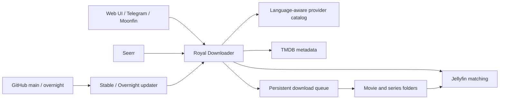

<p align="center">
  
</p>

<p align="center">
  <strong>Self-hosted media automation for Jellyfin, Telegram, and Seerr.</strong><br>
  Built for reliable 24/7 operation on Docker and NAS systems.
</p>

<p align="center">
  
  
  
  
  
  
</p>

Royal Downloader combines discovery, provider routing, a persistent download
queue, library checks, and media automation in one web application. Movies,
series, and anime are discovered through configurable language-aware providers,
checked against Jellyfin, and written directly to mounted media folders.

> [!IMPORTANT]
> Royal Downloader is intended for private, self-hosted use. Only access and
> store content for which you have the required rights. You are responsible for
> complying with applicable laws, copyright rules, and provider terms.

> [!WARNING]
> **Current release: `v1.0.0-rc.2` (Release Candidate).** This build may still
> expose issues before the final
> `v1.0.0`. Back up persistent data before upgrading. See the
> [release operations guide](docs/RELEASE.md) for installation, upgrade,
> backup, verification, and rollback steps.

## Why Royal Downloader?

Most self-hosted media workflows depend on several disconnected tools. Royal
Downloader keeps the full route visible and controllable:

```text
discover → match → de-duplicate → select provider → download → verify → scan Jellyfin
```

Its provider fallback logic is designed for sources that may disappear, throttle
downloads, present anti-bot gates, or expose different language tracks. Queue
state survives restarts, individual failures do not discard the remaining work,
and Jellyfin remains the source of truth for content already in the library.

## Highlights

- **Movies, series, and anime** in a responsive desktop and mobile interface.
- **Language-aware provider catalog** with separate German and English content
  profiles, provider priorities, and explicit download-language metadata.
- **Cross-provider discovery** with deterministic mixing, de-duplication,
  source distribution, and configurable fallback order.
- **Persistent queue** with resume support, integrity checks, hoster fallbacks,
  slow-source detection, and safe restart behavior.
- **Jellyfin de-duplication** for movies, series, seasons, and individual episodes.
- **Series subscriptions** for all missing content, the latest season, or the
  next season based on a Jellyfin user's watched state.
- **Telegram bot** for movie and series requests, queue status, storage status,
  and completion notifications.
- **Seerr and Moonfin bridge** for media requests without requiring Radarr or Sonarr.
- **TMDB metadata** for artwork, descriptions, genres, ratings, and runtime.
- **Jellyfin recommendations** maintained as an automatically updated collection.
- **Private cross-device taste profile** learned from discovery, downloads,
  subscriptions, explicit feedback, and Jellyfin playback without a cloud service.
- **Account-based sign-in** with a hashed password, persistent sessions that
  survive restarts, brute-force protection, and device sign-out.
- **Multilingual web UI** with language selection during onboarding and in settings.
- **In-app updater** plus queue-safe automatic updates for Royal Downloader and yt-dlp.
- **Stable and Overnight channels** with persistent selection, explicit
  development warnings, and guarded return-to-Stable branch changes.

## Recent improvements

- Added **Huhu** as a German movie and series provider, including exact
  season/episode matching and integration into the configurable fallback order.
- Made **Filmpalast the primary movie source**, followed by Huhu, and moved
  FilmFrei24 to the end of the default movie fallback chain.
- Added persistent provider health states for SerienStream. CAPTCHA and
  rate-limit responses pause the provider, retain waiting episodes, and allow
  only one controlled probe instead of repeatedly loading the blocked source.
- Kept movie downloads moving independently from paused or slow series
  fallbacks, while resolved transfers continue at the configured concurrency.
- Improved Jellyfin details with targeted per-series episode checks, explicit
  stale-state handling, and provider-independent subscription recognition.
- Added a private, shared taste profile for web and native clients, learned
  from browsing, downloads, subscriptions, feedback, and Jellyfin playback.

See [CHANGELOG.md](CHANGELOG.md) for the consolidated project history.

## Provider catalog

Providers are selectable and reorderable during onboarding and later in
settings. Their language is part of the central catalog and follows every
download job.

| Provider | Content language | Movies | Series | Anime |
|---|---:|:---:|:---:|:---:|
| FilmFrei24 | German | ✓ |  |  |
| Filmpalast | German | ✓ | ✓ |  |
| Huhu | German | ✓ | ✓ |  |
| MegaKino | German | ✓ | ✓ |  |
| Moflix | German | ✓ | ✓ |  |
| Einschalten | German | ✓ |  |  |
| Kinox | German | ✓ |  |  |
| KinoGer | German | ✓ | ✓ |  |
| XCine | German | ✓ | ✓ |  |
| SerienStream | German |  | ✓ |  |
| SFlix | English | ✓ | ✓ |  |
| Ridomovies | English | ✓ | ✓ |  |
| MKissa | English |  |  | ✓ |

> [!NOTE]
> Third-party providers can change or become unavailable without notice.
> Provider adapters are therefore isolated, ordered, and designed to fail over.

The default German movie order starts with **Filmpalast → Huhu** and ends with
**FilmFrei24**. For German series, **SerienStream** remains the primary source;
**Huhu → Moflix → MegaKino → Filmpalast** are the first fallback providers.
All orders can be changed in onboarding or settings.

## Quick start with Docker Compose

Requirements:

- Docker Engine
- Docker Compose v2
- Write access to the Jellyfin movie and series directories

```bash
git clone --branch v1.0.0-rc.2 --depth 1 https://github.com/TimeLance89/RoyalDownloader.git
cd RoyalDownloader
cp .env.example .env
```

Set at least `MOVIES_HOST_DIR` and `SERIES_HOST_DIR` in `.env`, then start:

```bash
docker compose up -d --build
docker compose logs -f seriendownloader
curl --fail http://127.0.0.1:8765/api/health
```

Open `http://<NAS-IP>:8765`. The first-run wizard configures the interface
language, content languages, providers, storage paths, Jellyfin, TMDB,
automation, Telegram, and the administrator account used to sign in.

> [!TIP]
> Never expose port `8765` directly to the public internet. Existing
> installations keep running without an account and show a reminder in
> **Settings → Access**, where the account can be created at any time.

See the complete [Docker and NAS guide](docs/DOCKER.md) for volume, Seerr, DNS,
update, and migration details.

Existing installations that previously followed continuous `main` should use
the documented [upgrade path to `v1.0.0-rc.2`](docs/RELEASE.md#upgrade-from-continuous-main).
Do not delete or replace `data/`; preserve `runtime/` until the upgraded
container has passed its health check and the rollback decision is complete.

The updater defaults to **Stable** (`main`). Advanced testers can opt into
**Overnight** (`overnight`) under **Settings → Updates and maintenance**. The
choice persists in `data/FilmeDownloader/settings.ini`; returning to Stable
requires confirmation when it would activate an older or diverged commit. See
the [update channel guide](docs/UPDATE_CHANNELS.md) before opting in.

## Architecture


```mermaid
flowchart LR
    UI["Web UI / Telegram / Moonfin"] --> API["Royal Downloader"]
    API --> CAT["Language-aware provider catalog"]
    API --> TMDB["TMDB metadata"]
    API --> JF["Jellyfin matching"]
    API --> Q["Persistent download queue"]
    Q --> MEDIA["Movie and series folders"]
    MEDIA --> JF
    SEERR["Seerr"] --> API
    GH["GitHub main / overnight"] --> UPD["Stable / Overnight updater"]
    UPD --> API
```

## Persistent data and updates

| Path | Purpose | Backup |
|---|---|---|
| `./data` | Settings, subscriptions, queue, taste profile, cookies, and Seerr state | Required |
| `./runtime` | Versioned releases, isolated dependencies, active and previous revision | Recommended |
| Movie and series mounts | Completed media files | Use your own backup policy |

The updater builds each revision in a staged release with its own Python
environment, runs compile/import smoke tests, and atomically switches the
`runtime/current` link only after success. `runtime/previous` keeps the complete
source and dependency set for rollback. It preserves `data`, `.env`, media
folders, and persistent settings.

Keep `.env`, `data/`, and private logs out of GitHub issues. They may contain
passwords, API keys, cookies, private addresses, chat IDs, and media paths.

## Documentation

| Topic | Document |
|---|---|
| Consolidated feature and behavior changes | [CHANGELOG.md](CHANGELOG.md) |
| Docker and NAS installation, volumes, environment variables, and integrations | [docs/DOCKER.md](docs/DOCKER.md) |
| Release installation, upgrade, backup, verification, and rollback | [docs/RELEASE.md](docs/RELEASE.md) |
| Stable/Overnight channels, safe switching, and promotion | [docs/UPDATE_CHANNELS.md](docs/UPDATE_CHANNELS.md) |
| Native Android clients | The app source is maintained separately; use the documented API contract below. |
| Android API, compatibility, authentication, and WebSocket contract | [docs/ANDROID_API.md](docs/ANDROID_API.md) |
| Persistent queue jobs, history, migration, and job controls | [docs/QUEUE_JOBS.md](docs/QUEUE_JOBS.md) |
| Jellyfin recommendation collection | [docs/JELLYFIN_RECOMMENDER.md](docs/JELLYFIN_RECOMMENDER.md) |
| Personalization signals, scoring, privacy, and API | [docs/PERSONALIZATION.md](docs/PERSONALIZATION.md) |
| Migration from the previous repository name | [docs/REPOSITORY_RENAME.md](docs/REPOSITORY_RENAME.md) |
| Development and pull requests | [CONTRIBUTING.md](CONTRIBUTING.md) |
| Architecture boundaries and lock ownership | [docs/ARCHITECTURE.md](docs/ARCHITECTURE.md) |
| Completed backend and frontend modularization | [docs/MODULARIZATION.md](docs/MODULARIZATION.md) |
| Reviewed dependency/image updates and rollback | [docs/DEPENDENCY_UPDATES.md](docs/DEPENDENCY_UPDATES.md) |
| Private vulnerability reporting | [SECURITY.md](SECURITY.md) |

## Project structure

```text
RoyalDownloader/
├─ providers/                 isolated movie, series, and anime adapters
├─ web/                       framework-free web application
├─ docs/                      installation and operations documentation
├─ api_*_router.py            domain-owned FastAPI and WebSocket routes
├─ application_services/      catalogs, downloads, integrations, and automation
├─ app_state.py               shared runtime state, caches, and locks
├─ server.py                  application wiring, lifecycle, and static hosting
├─ downloader.py              queue, transfer, and integrity verification
├─ jellyfin_client.py         library matching and de-duplication
├─ self_updater.py            verified GitHub update workflow
├─ docker-compose.yml         NAS and Docker Compose deployment
├─ Dockerfile                 reproducible runtime image
└─ start.sh                   mounted-folder NAS bootstrap
```

## Roadmap

- Additional content languages and provider adapters
- Broader anime coverage
- More provider health and routing intelligence
- Better diagnostics for unattended installations

## Contributing

Bug reports and focused pull requests are welcome. Start with
[CONTRIBUTING.md](CONTRIBUTING.md), use the matching GitHub issue form, and
remove credentials, cookies, private addresses, and media paths from all logs.

Royal Downloader is actively developed at
[TimeLance89/RoyalDownloader](https://github.com/TimeLance89/RoyalDownloader).
