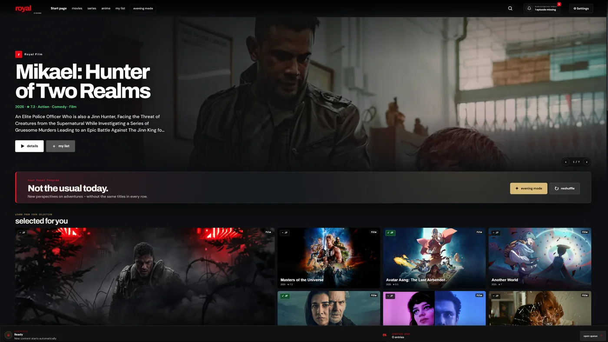
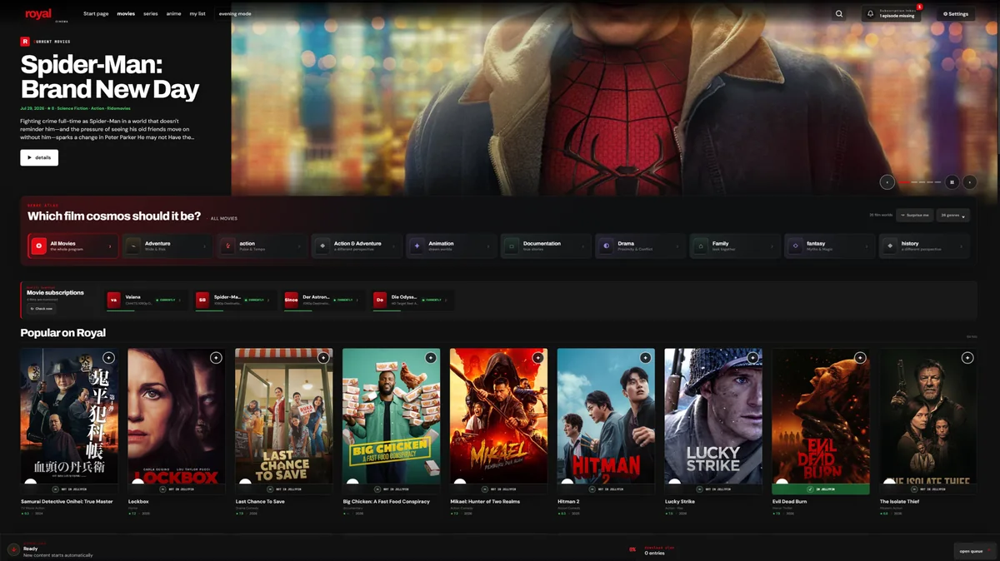
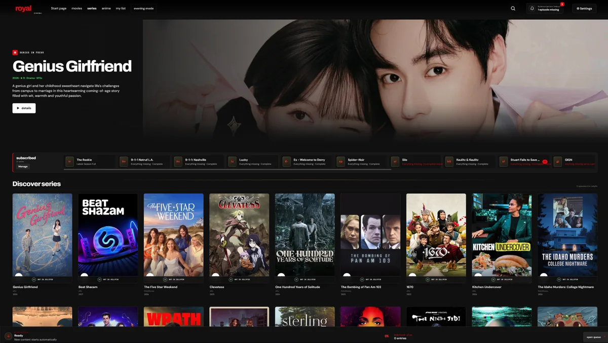
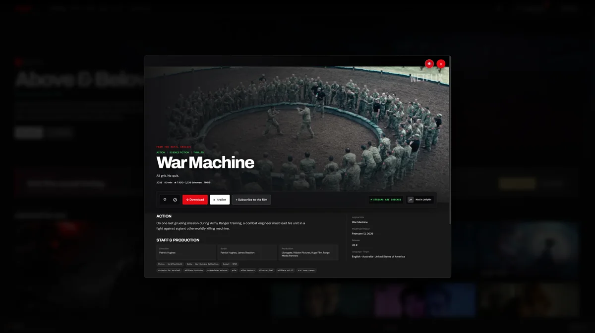
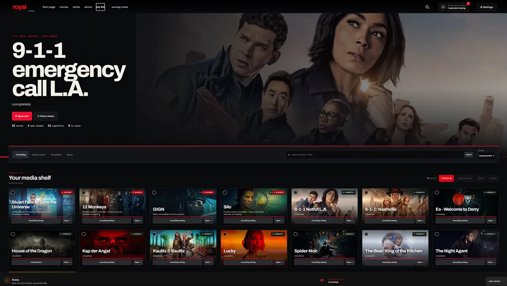
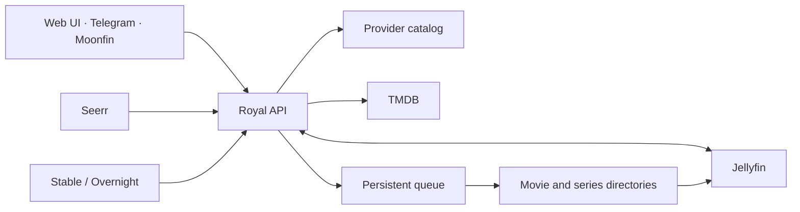

<p align="center">
  
</p>

<p align="center">
  <strong>Discover, automate, and keep your Jellyfin library in sync.</strong><br>
  A private, self-hosted media hub for movies, series, and anime — on your computer or NAS.
</p>

<p align="center">
  <a href="https://github.com/TimeLance89/RoyalDownloader/releases">
    
  </a>
  <a href="https://github.com/TimeLance89/RoyalDownloader/actions/workflows/quality.yml">
    
  </a>
  
  
  
  <a href="LICENSE">
    
  </a>
</p>

<p align="center">
  <a href="#quick-start"><strong>Quick start</strong></a> ·
  <a href="#what-royal-downloader-does"><strong>Features</strong></a> ·
  <a href="docs/DOCKER.md"><strong>Docker & NAS</strong></a> ·
  <a href="docs/RELEASE.md"><strong>Upgrade & rollback</strong></a> ·
  <a href="CHANGELOG.md"><strong>Changelog</strong></a>
</p>

Royal Downloader brings discovery, Jellyfin-aware library matching, provider
fallbacks, persistent download jobs, automation, and updates into one responsive
web application. It avoids offering media already present in Jellyfin and keeps
the complete path from request to library visible and controllable.


<p align="center">
  <a href="docs/assets/screenshots/home-desktop.webp">
    
  </a>
</p>

<p align="center">
  <sub>
    Personalized discovery, Jellyfin-aware availability, subscriptions, and a
    live download queue in one responsive interface.
  </sub>
</p>

> [!WARNING]
> **`v1.0.0-rc.3` is a release candidate.** Back up at least `.env` and `data/`
> before upgrading. See the [release guide](docs/RELEASE.md) for installation,
> verification, backup, and rollback instructions.

> [!IMPORTANT]
> Royal Downloader is intended for private, self-hosted use. Only access and
> store content for which you have the required rights. You are responsible for
> complying with applicable laws and provider terms.

## Why Royal Downloader?

| | |
|---|---|
| **Jellyfin-aware by design** | Detects existing movies, seasons, and episodes before work is queued. |
| **Built for unreliable sources** | Uses configurable provider and hoster fallbacks, cooldowns, integrity checks, and restart recovery. |
| **More than a download queue** | Adds subscriptions, Telegram requests, Seerr/Moonfin, recommendations, and scheduled automation. |
| **Private and self-hosted** | Runs locally or on a NAS, keeps the taste profile local, and stores persistent state under your control. |

## What Royal Downloader does

```text
Discover → Match metadata → Check Jellyfin → Select provider → Queue
         → Resolve stream → Download → Verify → Update library
```

| Area | Highlights |
|---|---|
| **Discovery** | Movies, series, anime, global search, language-aware catalogs, TMDB metadata, daily Top 10, Mood Mode, and personal recommendations |
| **Downloads** | Persistent logical jobs, per-attempt isolation, progress and history, integrity checks, provider and hoster fallback, safe restart recovery |
| **Jellyfin** | Detection of existing movies, seasons, and episodes, playback status, library scans, quality upgrades, and recommendation collections |
| **Automation** | Series subscriptions, scheduled checks, Telegram requests, Seerr/Moonfin, and configurable download windows |
| **Administration** | Local account, persistent sessions, device sign-out, backup-aware updates, rollback, and Stable/Overnight channels |
| **Personalization** | A private taste profile based on selections, feedback, downloads, subscriptions, Mood Mode, and Jellyfin playback |


## Interface preview

<table>
  <tr>
    <td width="50%">
      <a href="docs/assets/screenshots/movies-overview.webp">
        
      </a>
    </td>
    <td width="50%">
      <a href="docs/assets/screenshots/series-overview.webp">
        
      </a>
    </td>
  </tr>
  <tr>
    <td align="center">
      <strong>Movie discovery</strong><br>
      <sub>Browse current releases, genres, recommendations, and movie subscriptions.</sub>
    </td>
    <td align="center">
      <strong>Series discovery</strong><br>
      <sub>Track subscriptions, missing episodes, and Jellyfin availability.</sub>
    </td>
  </tr>
  <tr>
    <td width="50%">
      <a href="docs/assets/screenshots/movie-details.webp">
        
      </a>
    </td>
    <td width="50%">
      <a href="docs/assets/screenshots/my-list-archive.webp">
        
      </a>
    </td>
  </tr>
  <tr>
    <td align="center">
      <strong>Detailed media pages</strong><br>
      <sub>Review metadata, Jellyfin state, streams, trailers, and download actions.</sub>
    </td>
    <td align="center">
      <strong>Royal Archive</strong><br>
      <sub>Manage tracked series, incomplete items, queue state, and library status.</sub>
    </td>
  </tr>
</table>


## Quick start

### Docker Compose — recommended for NAS and home servers

**Requirements:** Docker Engine, Docker Compose v2, and write access to the movie
and series directories.

```bash
git clone --branch v1.0.0-rc.3 --depth 1 https://github.com/TimeLance89/RoyalDownloader.git
cd RoyalDownloader
cp .env.example .env
```

Set at least the media paths in `.env`:

```dotenv
MOVIES_HOST_DIR=/path/to/Movies
SERIES_HOST_DIR=/path/to/Series
```

Start and verify the service:

```bash
docker compose up -d --build
docker compose logs -f seriendownloader
curl --fail http://127.0.0.1:8765/api/health
```

Open `http://<NAS-IP>:8765` and select **NAS / home server** during first-run
setup.

> [!TIP]
> Never expose port `8765` directly to the public internet. Use a secured reverse
> proxy or tunnel for remote access. See the complete
> [Docker and NAS guide](docs/DOCKER.md).

<details>
<summary><strong>Windows</strong></summary>

**Requirements:** Python 3.12 or newer and Google Chrome or Chromium.

Download or clone the repository, then double-click
[`start_windows.cmd`](start_windows.cmd). The launcher checks the Python
dependencies and opens Royal in the browser.

Alternatively, use PowerShell:

```powershell
py -3 -m pip install -r requirements.lock
py -3 server.py
```

Select **Regular computer** and choose separate movie and series directories.

</details>

<details>
<summary><strong>macOS or Linux</strong></summary>

```bash
git clone --branch v1.0.0-rc.3 --depth 1 https://github.com/TimeLance89/RoyalDownloader.git
cd RoyalDownloader
python3 -m pip install -r requirements.lock
python3 server.py
```

Select **Regular computer**. Royal binds locally and opens the interface in the
default browser.

</details>

<details>
<summary><strong>NAS with <code>start.sh</code></strong></summary>

This mode is intended for NAS systems that mount the project directory into a
Python container.

```bash
git clone --branch v1.0.0-rc.3 --depth 1 https://github.com/TimeLance89/RoyalDownloader.git
cd RoyalDownloader
bash start.sh
```

`start.sh` prepares Chromium, ffmpeg, Python dependencies, and the versioned
runtime. Select **NAS / home server** during first-run setup. If `.env` is
missing, it is created from `.env.example`.

</details>

## One project, two operating modes

The first-run wizard asks where Royal should run. The mode can later be changed
under **Settings → General → Operating mode**.

| | Regular computer | NAS / home server |
|---|---|---|
| **Best for** | Windows, macOS, or Linux desktop use | Continuous service on the home network |
| **Network** | Accessible only on the current computer | Accessible throughout the local network |
| **Browser** | Opens automatically | Open `http://<NAS-IP>:8765` from another device |
| **Start** | `start_windows.cmd` or `python server.py` | Docker Compose or `start.sh` |
| **Storage** | Local folders | Mounted media directories |

When only `.env.example` exists, setup creates a matching `.env` automatically.
Custom variables are preserved when the operating mode is changed later.

## First-run setup

The wizard guides you through six steps:

1. **Operating mode and language** — computer or NAS and interface language
2. **Sources** — content languages, providers, and fallback order
3. **Storage** — separate movie and series directories
4. **Library** — optional Jellyfin connection and required TMDB access
5. **Automation** — subscriptions, download windows, and Telegram
6. **Access** — local administrator account

Setup starts in English and translates immediately when another language is
selected. A valid TMDB API key or read access token is required and verified
before configuration is saved.

> Credentials, API keys, cookies, and private paths must never be committed to
> Git or included in public bug reports.

## Integrations

| Integration | What it adds |
|---|---|
| **Jellyfin** | Library matching, playback status, duplicate prevention, scans, quality upgrades, and recommendations |
| **TMDB** | Stable IDs, artwork, descriptions, genres, runtime, ratings, cast, and discovery metadata |
| **Telegram** | Movie and series requests, queue and storage status, and completion notifications |
| **Seerr / Moonfin** | Direct media requests without requiring a Radarr or Sonarr workflow |
| **GitHub Updater** | Verified Stable and Overnight revisions with atomic activation and rollback |

## Stable and Overnight updates

Choose the update channel under **Settings → Updates and maintenance**.
If an older updater cannot activate itself, build a copyable recovery package
with `python scripts/build_nas_update.py --ref origin/overnight`; the exact NAS
installation procedure is documented in `docs/UPDATE_CHANNELS.md`.

| Channel | Intended use |
|---|---|
| **Stable** | Recommended for normal use. Follows `main` and receives deliberately promoted releases. |
| **Overnight** | Early access to newer changes. Follows `overnight` and only offers commits whose quality checks passed. |

The updater prepares revisions in isolation, verifies them, and only then
switches atomically. `runtime/previous` remains available for rollback. Returning
from Overnight to an older or diverged Stable revision requires explicit
confirmation.

If GitHub's anonymous API limit is reached, add a fine-grained read-only token
to `.env`:

```dotenv
UPDATE_GITHUB_TOKEN=github_pat_your_token
```

Stable requires repository contents read access. Overnight additionally needs
read access to checks. Restart Royal after changing `.env`.

<details>
<summary><strong>Supported providers</strong></summary>

| Provider | Language | Movies | Series | Anime |
|---|:---:|:---:|:---:|:---:|
| Filmpalast | DE | ✓ | ✓ | |
| Filmo | DE | ✓ | | |
| Huhu | DE | ✓ | ✓ | |
| MegaKino | DE | ✓ | ✓ | |
| Moflix | DE | ✓ | ✓ | |
| FilmFrei24 | DE | ✓ | | |
| Einschalten | DE | ✓ | | |
| Kinox | DE | ✓ | | |
| KinoGer | DE | ✓ | ✓ | |
| XCine | DE | ✓ | ✓ | |
| SerienStream | DE | | ✓ | |
| SFlix | EN | ✓ | ✓ | |
| Ridomovies | EN | ✓ | ✓ | |
| MKissa | EN | | | ✓ |

Third-party providers can change or become unavailable at any time. Royal keeps
adapters isolated and follows the configured fallback order when a source fails.

</details>

## Persistent data and backups

| Path | Contents | Backup priority |
|---|---|---|
| `.env` | Operating mode, mounts, update token, and optional environment variables | **Required** |
| `data/` | Settings, account, queue, history, subscriptions, cookies, and taste profile | **Required** |
| `runtime/` | Active and previous versioned application releases | Recommended |
| Media directories | Completed movies and series | Use your own media backup strategy |

Before every release upgrade, back up at least `.env` and `data/`. Keep
`runtime/` until the updated installation passes its health check and the
rollback decision is complete.

## Architecture


```mermaid
flowchart LR
    CLIENTS["Web UI · Telegram · Moonfin"] --> API["Royal API"]
    API --> CATALOG["Provider catalog"]
    API --> TMDB["TMDB"]
    API <--> JELLYFIN["Jellyfin"]
    API --> QUEUE["Persistent queue"]
    QUEUE --> MEDIA["Movie and series directories"]
    MEDIA --> JELLYFIN
    SEERR["Seerr"] --> API
    UPDATE["Stable / Overnight"] --> API
```

<details>
<summary><strong>Project structure</strong></summary>

```text
RoyalDownloader/
├─ application_services/    catalogs, downloads, automation, and integrations
├─ providers/               isolated movie, series, and anime adapters
├─ web/                     responsive framework-free web application
├─ docs/                    operations, API, and architecture documentation
├─ api_*_router.py          FastAPI and WebSocket endpoints
├─ server.py                composition, lifecycle, and web hosting
├─ downloader.py            queue, transfer, fallback, and integrity verification
├─ jellyfin_client.py       library matching and de-duplication
├─ environment_file.py      safe .env generation and operating-mode management
├─ start_windows.cmd        Windows launcher
├─ start.sh                 NAS and mounted-source bootstrap
├─ docker-compose.yml       Docker deployment
└─ .env.example             documented configuration template
```

</details>

## Documentation

| Topic | Document |
|---|---|
| Changes and new features | [CHANGELOG.md](CHANGELOG.md) |
| Docker, NAS, volumes, and remote access | [docs/DOCKER.md](docs/DOCKER.md) |
| Installation, upgrades, backups, and rollback | [docs/RELEASE.md](docs/RELEASE.md) |
| Stable and Overnight channels | [docs/UPDATE_CHANNELS.md](docs/UPDATE_CHANNELS.md) |
| Persistent queue jobs and history | [docs/QUEUE_JOBS.md](docs/QUEUE_JOBS.md) |
| Jellyfin recommendations | [docs/JELLYFIN_RECOMMENDER.md](docs/JELLYFIN_RECOMMENDER.md) |
| Personalization and privacy | [docs/PERSONALIZATION.md](docs/PERSONALIZATION.md) |
| Android API and WebSocket contract | [docs/ANDROID_API.md](docs/ANDROID_API.md) |
| Architecture and ownership boundaries | [docs/ARCHITECTURE.md](docs/ARCHITECTURE.md) |
| Development and pull requests | [CONTRIBUTING.md](CONTRIBUTING.md) |
| Private vulnerability reporting | [SECURITY.md](SECURITY.md) |

## Contributing

Bug reports, documentation improvements, translations, tests, and focused pull
requests are welcome. Read [CONTRIBUTING.md](CONTRIBUTING.md) first and remove
all private data from logs and screenshots.

For security issues, follow [SECURITY.md](SECURITY.md) instead of opening a
public issue.

## License

RoyalDownloader is open-source software licensed under the
[Apache License 2.0](LICENSE).

See [NOTICE](NOTICE) for copyright and attribution information.

Third-party libraries, services, trademarks, provider content, and media
metadata remain subject to their respective licenses and terms.

<p align="center">
  <strong>Built for private, self-hosted media workflows.</strong><br>
  <a href="https://github.com/TimeLance89/RoyalDownloader">TimeLance89/RoyalDownloader</a>
</p>
