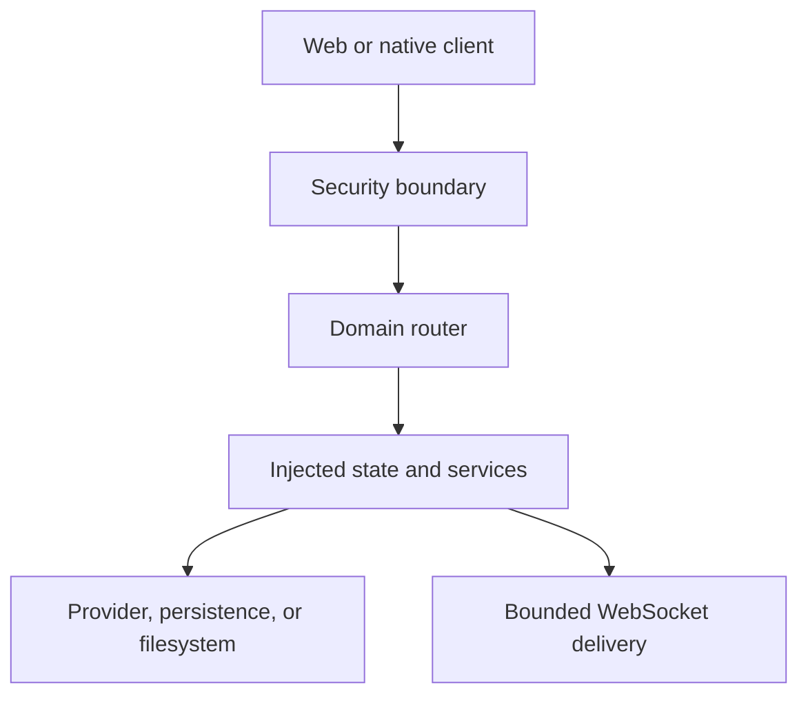

# Modularization of Royal Downloader

[← Documentation index](README.md) · [Architecture rules](ARCHITECTURE.md)

This document describes the large internal restructuring completed on
2026-08-02. The refactor keeps the public HTTP, WebSocket, frontend, storage,
and update contracts stable while replacing the largest executable monoliths
with explicit ownership boundaries.

## Why this change was necessary

`server.py`, `web/app.js`, and `web/style.css` previously combined unrelated
responsibilities in single files. A change to one feature could therefore
affect route registration, mutable process state, frontend startup order, or
the CSS cascade of another feature. Review was difficult, merge conflicts were
large, and ownership was implicit.

The refactor establishes these rules:

- each API domain owns its routes;
- shared mutable runtime state has one owner;
- WebSocket authentication and delivery are separate concerns;
- frontend features load in a declared dependency order;
- stylesheet cascade order is explicit;
- compatibility is verified by route and frontend contract tests;
- source-size guards prevent new monoliths from silently replacing the old ones.

## Result at a glance

| Entry point | Before | After | Result |
|---|---:|---:|---|
| `server.py` | 13,394 lines | 8,790 lines | Composition root and remaining service orchestration |
| `web/app.js` | 7,170 lines | 553 lines | Bootstrap and final event binding only |
| `web/style.css` | 13,247 lines | 15 lines | Ordered stylesheet manifest |
| API router modules | transitional ownership | 8 production routers | Routes grouped by domain |
| Frontend screen modules | none | 10 modules | Feature-specific browser behavior |
| Focused stylesheets | none | 14 modules | Explicit cascade phases and feature ownership |

`web/index.html` intentionally remains a synchronous declarative DOM shell.
Loading HTML fragments asynchronously would weaken the existing element-ID and
startup contract. Executable behavior and visual ownership no longer live in
that file.

## Backend boundaries

| Module | Responsibility |
|---|---|
| `api_security.py` | Authentication middleware, public-route policy, origin validation, and security headers |
| `api_auth_router.py` | Browser and bearer login, sessions, account management, and sign-out routes |
| `api_setup_router.py` | First-run setup HTTP boundary |
| `api_discovery_router.py` | Movie, series, anime, TMDB, and targeted Jellyfin discovery |
| `api_queue_router.py` | Queue lifecycle, taste events, preparation, removal, and cancellation |
| `api_library_router.py` | Cover proxy, subscriptions, watchlist, watched-state reconciliation, and cleanup |
| `api_administration_router.py` | Runtime, updater, provider, storage, Jellyfin, TMDB, automation, Telegram, and Seerr settings |
| `api_system_router.py` | Health, capabilities, and cache diagnostics |
| `api_websocket_router.py` | WebSocket aliases, origin checks, authentication, revalidation, and initial snapshot |
| `app_state.py` | Mutable process state, locks, caches, provider instances, and queue state |
| `websocket_manager.py` | Bounded per-client event delivery and slow-client isolation |
| `media_paths.py` | Persistent media-path validation and misplaced-file recovery |
| `server.py` | Application composition, dependency injection, lifespan, and remaining service orchestration |

The required dependency direction is:

```text
routers → services → providers/persistence → filesystem or network
```

Routers must not import `server.py`. During migration, injected facades keep
legacy test seams available without introducing a reverse dependency.

## Request and event flow



HTTP handlers validate and translate requests. Runtime state and locks stay in
`AppState`. Blocking persistence and provider work must run outside the async
event loop. Structural events are published through `WSManager`, which prevents
one slow browser from blocking producers or other clients.

## Route ownership and compatibility

The restructuring does not intentionally change client contracts:

- legacy `/api/...` routes remain available;
- additive `/api/v1/...` aliases remain available;
- `/ws` and `/api/v1/ws` retain their authentication behavior;
- `/api/v1/ws` still sends the initial versioned snapshot;
- browser cookie sessions and native bearer sessions retain their separation;
- route method/path pairs remain unique;
- static frontend mounting still occurs after API and WebSocket registration.

`api_domain_routers.py` records explicit domain ownership for discovery, queue,
library, administration, and live updates. Tests fail if a route loses its
owner, a duplicate method/path pair appears, or an endpoint drifts back into
the composition root.

## Frontend module order

`web/index.html` loads browser code in dependency order:

1. API transport and shared store;
2. shared core navigation, live updates, and queue UI;
3. screen modules under `web/screens/`;
4. `web/app.js` for final event binding and startup.

Screen modules own one feature area and do not start the application. They may
depend on core functions or on earlier declared domain modules. The frontend
smoke suite validates ordering as well as login, detail, queue, settings,
mobile lazy loading, unique IDs, and nested JavaScript syntax coverage.

## Stylesheet cascade

`web/style.css` is now an import manifest rather than a rule container. Its
order is part of the application contract:

1. design tokens and base rules;
2. focused legacy layers preserving historical specificity;
3. feature stylesheets;
4. final ordered overrides and responsive rules.

Moving a rule between files must preserve its cascade phase unless a visual
change is intentional and tested. Adding unordered imports to individual
screen stylesheets is discouraged because it makes precedence implicit again.

## State, locking, and concurrency

`app_state.py` is the single owner of mutable process state and its associated
locks. Code must not create parallel state containers for the same data.

When multiple locks are unavoidable, acquire them only in this order and
release them in reverse:

```text
queue_lifecycle → queue_claim → download_state → watchlist
```

Provider locks remain outside this chain. Async handlers must never await while
holding a threading lock. Cache callbacks used for pin decisions must not
re-enter cache locks.

## Regression and safety checks

The restructuring is protected by the following checks:

- complete Python regression suite;
- browser contract smoke suite;
- syntax checks for every JavaScript file, including nested modules;
- route ownership and duplicate-route tests;
- WebSocket authentication, ordering, and slow-client tests;
- HTTP security and authentication-router tests;
- mobile movie and series lazy-loading contracts;
- duplicate HTML ID detection;
- Ruff correctness checks and Bandit security checks;
- locked-dependency vulnerability audit;
- source-size budgets for the composition root and frontend modules.

At completion, the repository passed 149 Python tests and 6 frontend contract
tests. The dependency audit reported no known vulnerabilities.

## Adding a new feature

Use this sequence for new work:

1. choose the owning domain before adding an endpoint;
2. put HTTP translation in the matching router;
3. inject service and state dependencies instead of importing `server.py`;
4. keep blocking I/O in provider, persistence, or worker-thread code;
5. add browser behavior to the owning screen module;
6. add styles in the correct cascade phase;
7. retain both legacy and v1 routes when extending an existing contract;
8. add focused tests and run the full regression suite.

If no existing domain fits, create a focused router and register it as an
explicit owner. Do not add a new `@app.get`, `@app.post`, or `@app.websocket`
handler to `server.py`; the module-boundary test rejects that regression.

## Deployment impact

The change is source-internal. Persistent data formats, configured media paths,
Docker volumes, runtime releases, update rollback, and Jellyfin library paths
are unchanged. Existing installations can update normally through the versioned
runtime. A rollback still switches to the previous complete release rather than
mixing modules from two revisions.

Because the browser now loads additional static files, reverse proxies and
custom caches must serve the complete `web/` directory and must not retain an
old `index.html` across a deployment. Royal Downloader's normal static-file
responses already prevent stale application entry points.

## Remaining direction

The largest remaining file is the composition root because it still contains
service orchestration and compatibility facades. Future extraction should move
cohesive services only when their state, I/O, and tests can move together. Line
count alone is not a reason to break an atomic workflow across unrelated files.

The authoritative dependency and lock rules remain in
[ARCHITECTURE.md](ARCHITECTURE.md). This document records the completed change,
its compatibility guarantees, and the extension model for contributors.
